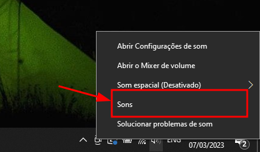
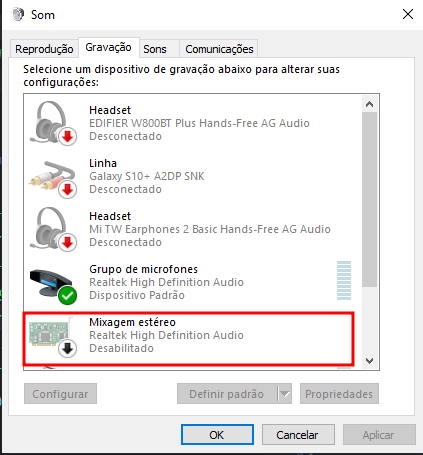
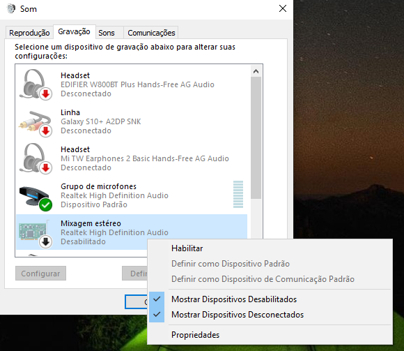
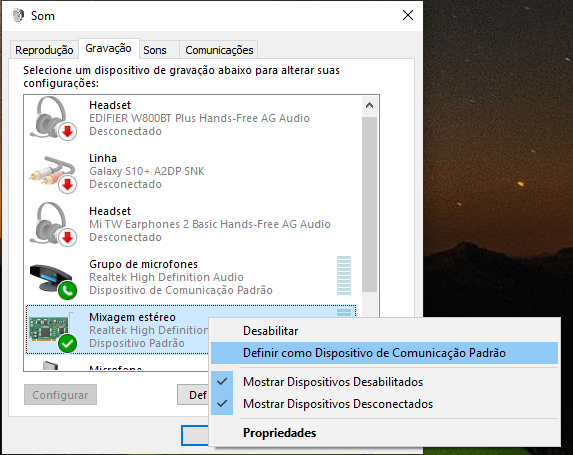

Please, follow this steps if you are using on Windows!

<!-- truncate -->

### 1.First

Right click on the sound icon.

### 2.Second

Click on "Sounds".

### 3.Third

Go to the "Record" Tab and right click on the first Stereo option with the same left-icon.

### 4.Fourth

Then select the enable option.

### 5.Fifth

Select as the "Default device"

