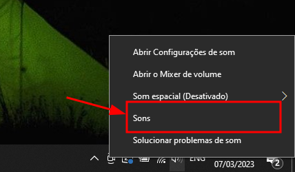
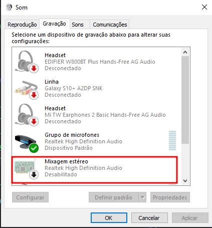
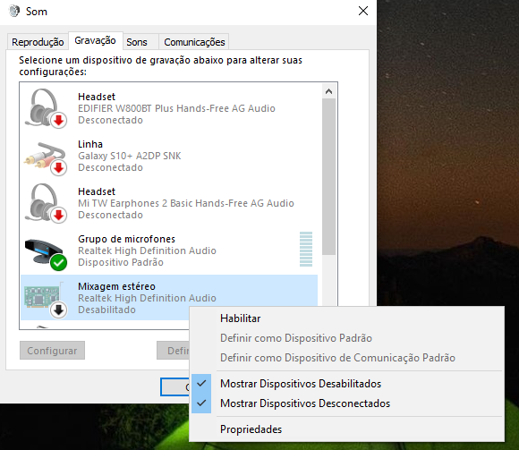
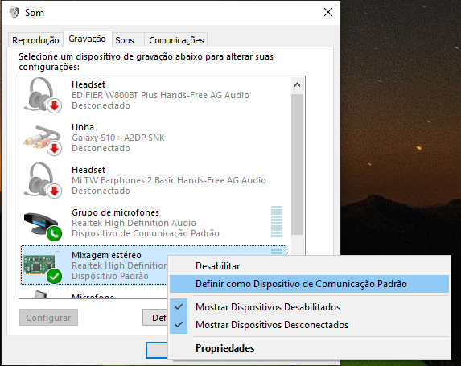

Por favor, siga estes passos se você estiver usando no Windows!

<!-- truncate -->

### 1. Primeiro

Clique com o botão direito no ícone de som na barra de tarefas.

### 2. Segundo

Clique em "Sons".

### 3. Terceiro

Vá para a aba "Gravar" e clique com o botão direito na primeira opção Estéreo com o mesmo ícone esquerdo.

### 4. Quarto

Em seguida, selecione a opção habilitar.

### 5. Quinto

Selecione como o "dispositivo padrão"

